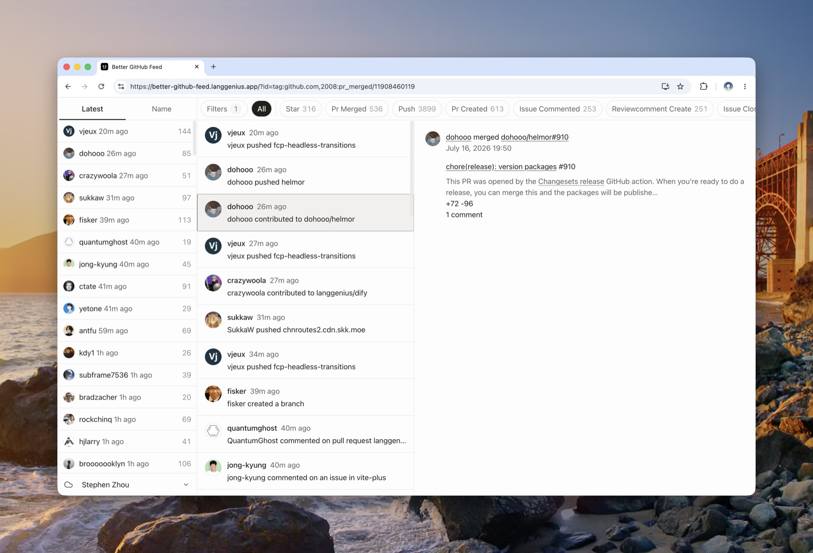
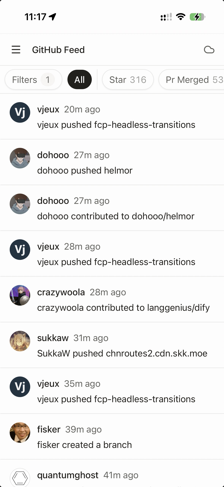
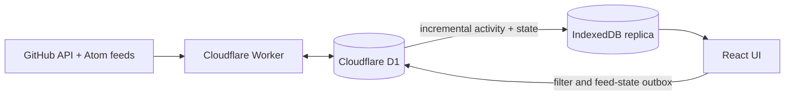

<div align="center">

# Better GitHub Feed

**Your GitHub Following, organized into a fast local-first feed.**

[Open the app](https://better-github-feed.langgenius.app/) · [Run locally](#local-development) · [Deploy](#deployment)

</div>

<table>
  <tr>
    <td width="72%">
      
    </td>
    <td width="28%">
      
    </td>
  </tr>
</table>

Better GitHub Feed collects the public activity of the developers you follow on GitHub and turns it into one unified, filterable feed. The browser keeps a complete local replica in IndexedDB, so navigation and filtering stay immediate while cloud synchronization runs separately.

## Highlights

- **Local-first by default** — the interface reads from IndexedDB instead of waiting for network queries.
- **Automatic GitHub Following sync** — your feed follows the same people you follow on GitHub.
- **Powerful filters** — hide activity by actor, repository, event type, or nested filter rules.
- **Cross-device state** — filters and feed preferences synchronize through a durable local outbox.
- **Incremental updates** — the browser downloads only remote changes after the initial replica is created.
- **Desktop, mobile, and PWA** — responsive layouts, install support, and offline access to local data.
- **Background refresh** — a Cloudflare Cron Trigger refreshes GitHub Following and Activity every 20 minutes.

## How synchronization works



1. The Worker reconciles each account's GitHub Following and stores shared GitHub Activity in D1.
2. A newly registered account immediately refreshes followed users that have never been fetched, up to the first 50; scheduled refreshes continue the remainder.
3. The browser creates an account-scoped IndexedDB database and pulls the complete current revision.
4. Later sync cycles transfer only new activity, Following revisions, and user-state changes.
5. The UI always queries the local database. Starting the app, returning to it, reconnecting, and a five-minute foreground interval trigger cloud checks.

There is no manual refresh flow. Remote sync status and progress are shown globally without blocking local navigation.

## Architecture

The project deploys as one Cloudflare Worker and serves the SPA and API from the same origin.

| Layer          | Technology                                           |
| -------------- | ---------------------------------------------------- |
| Web            | React 19, React Router, Tailwind CSS, Vite, PWA      |
| Local data     | Dexie and IndexedDB                                  |
| API            | Hono and oRPC                                        |
| Authentication | Better Auth and GitHub OAuth                         |
| Cloud data     | Cloudflare D1 and Drizzle ORM                        |
| Runtime        | Cloudflare Workers, Static Assets, and Cron Triggers |
| Tooling        | Vite+ and pnpm workspaces                            |

API routes live under `/api/*`; every other navigation request falls back to the SPA.

## Local development

### Prerequisites

- A [GitHub OAuth App](https://github.com/settings/developers)
- [Vite+](https://viteplus.dev/guide/)

Install Vite+ and the workspace dependencies:

```sh
curl -fsSL https://vite.plus | bash
vp install
```

Copy the local secrets template:

```sh
cp apps/web/.dev.vars.example apps/web/.dev.vars
```

Configure the OAuth credentials in `apps/web/.dev.vars`:

```dotenv
BETTER_AUTH_URL=http://localhost:5173
BETTER_AUTH_SECRET=<openssl rand -base64 32>
BETTER_AUTH_GITHUB_CLIENT_ID=<github-oauth-client-id>
BETTER_AUTH_GITHUB_CLIENT_SECRET=<github-oauth-client-secret>
```

Use this callback URL in the development GitHub OAuth App:

```txt
http://localhost:5173/api/auth/callback/github
```

Start the full application:

```sh
vp run dev
```

The command applies local D1 migrations before starting the SPA and Worker at [http://localhost:5173](http://localhost:5173).

### Validation

```sh
vp check
vp test
vp run build
```

## Project structure

```txt
better-github-feed/
├── apps/
│   ├── web/           # React SPA, PWA, Worker configuration, and deployment scripts
│   │   └── public/    # PWA icons, screenshots, manifest, and static headers
│   └── server/        # Hono Worker entrypoint and scheduled maintenance
├── packages/
│   ├── api/           # Sync protocol, feed ingestion, routers, and domain logic
│   ├── auth/          # Better Auth configuration
│   ├── contract/      # Shared oRPC contracts
│   ├── db/            # Drizzle schema and D1 migrations
│   ├── env/           # Typed Cloudflare bindings
│   └── shared/        # Shared types and utilities
└── docs/              # Architecture and implementation research
```

## Deployment

The repository is ready for [Cloudflare Workers Builds](https://developers.cloudflare.com/workers/ci-cd/builds/). Import it in **Workers & Pages** with these settings:

```txt
Production branch: main
Root directory: apps/web
Build command: pnpm build
Deploy command: pnpm run deploy
```

Add the following build variables and encrypted secrets:

```txt
DEPLOY_BETTER_AUTH_URL=https://your-worker.example.com
DEPLOY_BETTER_AUTH_SECRET=<openssl rand -base64 32>
DEPLOY_BETTER_AUTH_GITHUB_CLIENT_ID=<github-oauth-client-id>
DEPLOY_BETTER_AUTH_GITHUB_CLIENT_SECRET=<github-oauth-client-secret>
```

Use a custom Cloudflare API token with **Workers Scripts: Edit**, **D1: Edit**, and the standard account and user read permissions. Configure the production GitHub OAuth App callback as:

```txt
https://your-worker.example.com/api/auth/callback/github
```

The deploy script uploads an inactive Worker version, provisions the D1 binding, applies migrations, and then publishes the SPA, API, and Cron Trigger together.

<details>
<summary>Migrating an existing Alchemy deployment</summary>

Do not run the old `pnpm destroy` command; it can delete the production D1 database.

Before the first Wrangler deployment, copy the existing D1 database ID from the Cloudflare dashboard into the `DB` binding in `apps/web/wrangler.jsonc`:

```jsonc
{
  "binding": "DB",
  "database_name": "better-github-feed-database-prod",
  "database_id": "<existing-d1-database-id>",
  "migrations_dir": "../../packages/db/src/migrations",
}
```

Wrangler reuses the existing `d1_migrations` table and applies only pending migrations. After verifying the combined Worker, remove the old Web and Server Workers separately so the old Cron Trigger stops running.

</details>

## Useful commands

| Command                    | Purpose                                               |
| -------------------------- | ----------------------------------------------------- |
| `vp run dev`               | Apply local migrations and start the full application |
| `vp check`                 | Format, lint, and type-check the workspace            |
| `vp test`                  | Run the test suite                                    |
| `vp run build`             | Build and verify the SPA, Worker, and PWA             |
| `vp run preview`           | Preview the production bundle locally                 |
| `vp run db:generate`       | Generate a Drizzle migration                          |
| `vp run db:migrate:local`  | Apply migrations to local D1                          |
| `vp run db:migrate:remote` | Apply migrations to production D1                     |
| `vp run deploy`            | Migrate and deploy the production Worker              |
| `vp run cf-typegen`        | Regenerate Cloudflare binding types                   |
