# Local-First Incremental Sync Design

Date: 2026-07-16

Status: Implemented locally; pending deployment

Scope: GitHub Activity, GitHub Following, User Filters, and the feed clear watermark

## Outcome

The browser becomes a real local-first application:

- Dexie is the only read path used by the UI.
- A local query returns immediately and creates demand for any missing remote range.
- Visible Feed, type counts, User Filter evaluation, and clear-watermark evaluation are derived locally.
- GitHub Atom ingestion remains automatic on the Worker Cron and is materialized in D1.
- D1-to-Dexie transfer is incremental and demand-driven.
- User Filter and clear-watermark writes commit to Dexie and a durable outbox before any network request.
- All manual Activity Refresh and manual Following Sync controls are removed.

The selected technology is Dexie OSS. The evaluation and rejected alternatives are recorded in [Local-First Storage and Incremental Sync Options](./local-first-options.md).

## Product decisions

| Concern            | Decision                                                                                                                                          |
| ------------------ | ------------------------------------------------------------------------------------------------------------------------------------------------- |
| Feed semantics     | Preserve the current GitHub Atom content and interpretation.                                                                                      |
| GitHub source      | Atom only for Activity. Do not mix in `received_events` or REST Events.                                                                           |
| Server ingestion   | Keep `GitHub -> Worker Cron -> D1`, including the current 20-minute schedule.                                                                     |
| On-demand boundary | Apply on-demand behavior to `D1 -> browser`, not `GitHub -> D1`.                                                                                  |
| Browser payload    | Pull complete normalized Atom entries for the demanded range; never send a server-filtered Visible Feed.                                          |
| Browser authority  | Dexie is the only UI read path and the immediate authority for local writes.                                                                      |
| Cloud authority    | GitHub is authoritative for Activity and Following. D1 is a bounded materialization and the convergence point for cross-device user state.        |
| Activity retention | The application never expires or evicts a locally stored Activity. D1 cleanup never propagates a delete.                                          |
| New devices        | A new device can only download the current bounded D1 window. Old device-only history is not recoverable.                                         |
| User state         | User Filters and the clear watermark sync across devices through local outbox, pull/rebase, CAS, receipts, and tombstones.                        |
| Automation         | Check on start, focus, reconnect, and every five minutes while the feed is visible. Pause in the background.                                      |
| Multi-tab          | Elect one sync leader; all tabs observe the same Dexie commits.                                                                                   |
| Sign out           | Delete the account database by default. An explicit keep-local-data choice leaves it locked until the same GitHub numeric ID authenticates again. |
| Import/export      | Not included in v1.                                                                                                                               |
| Encryption         | No application-level IndexedDB encryption in v1.                                                                                                  |
| Media              | Cache avatars and content images on demand with a bounded Cache Storage LRU. External links remain online-only.                                   |

### Meaning of "permanent local Activity"

"Permanent" means that this application does not apply a TTL, size-based eviction, D1 cleanup, or filter-driven deletion to Activity already committed to the current account database. It is not a backup guarantee. Browser storage eviction, profile deletion, application-data clearing, database corruption, or sign-out deletion can still destroy it. The application should request persistent storage and report whether the request was granted, but it cannot promise browser-level durability.

## Current system and the pivot

Today, the Worker Cron first refreshes Following, then Atom Activity, then removes older D1 Activity. The browser calls a server-side Visible Feed query and persists React Query result snapshots in one global IndexedDB key. Those snapshots are filtered, paginated projections rather than a durable entity model, so they cannot support correct offline filter edits or coverage accounting.

The pivot keeps the upstream half and replaces the downstream half:

```mermaid
flowchart LR
  GH["GitHub Following + Atom"] -->|"20-minute Cron"| INGEST["Worker ingestion"]
  INGEST --> D1["Bounded D1 replica"]
  D1 <-->|"versioned sync protocol"| SYNC["IncrementalSync"]
  SYNC -->|"atomic entity + checkpoint commits"| DX["Per-account Dexie"]
  DX --> LF["LocalFeed"]
  LF --> UI["React hooks and UI"]
  UI -->|"Filter / delete / clear"| LF
  LF -->|"local state + durable outbox"| DX
```



The UI never renders a network response. A response becomes visible only after its records and checkpoint commit atomically to Dexie.

## Authority and ownership

| Data             | Upstream authority  | D1 role                                                             | Dexie role                                                                            |
| ---------------- | ------------------- | ------------------------------------------------------------------- | ------------------------------------------------------------------------------------- |
| GitHub Following | GitHub complete set | Last complete versioned snapshot                                    | Active local snapshot used by every query                                             |
| Atom Activity    | GitHub Atom         | Bounded append materialization, approximately 200 entries per actor | Append-only device history and only UI read source                                    |
| User Filter      | User intent         | Cross-device canonical version and tombstone                        | Immediate optimistic state plus server shadow and outbox                              |
| Clear watermark  | User intent         | Monotonic cross-device value                                        | Immediate optimistic value plus server shadow and outbox                              |
| Visible Feed     | Derived             | None                                                                | Derived from Following, raw Activity, User Filters, clear watermark, and current view |
| Statistics       | Derived             | None                                                                | Derived from locally available raw Activity and labeled with coverage                 |

GitHub logins are mutable, non-unique aliases. New protocol records use the GitHub numeric user ID as actor identity. Atom entry IDs remain Activity identity, namespaced as `github-atom-v1` so a future source cannot accidentally deduplicate against them. A legacy row whose numeric actor ID is not yet known retains an explicitly unresolved `legacy-atom-login:<login>` actor key; it is never discarded or presented as a numeric ID.

## Deep module boundary

`LocalFeed` is the only business interface exposed to React. Dexie tables, D1 revisions, cursors, leases, retries, and outbox exchange stay behind it.

```ts
type NonEmpty<T> = readonly [T, ...T[]]

type FeedView = {
  actors: 'following' | NonEmpty<string> // stable actor keys
  types: 'all' | NonEmpty<string>
}

type CoverageFacts = {
  bootstrap: 'never-synced' | 'initialized'
  demand: 'satisfied' | 'insufficient'
  hasMoreLocal: boolean
  remoteWindow: 'unchecked' | 'may-have-more' | 'exhausted'
  integrity: 'continuous' | 'gap-detected'
}

type FollowingWindow = {
  items: readonly FollowingSummary[]
  totalLocal: number
  coverage: CoverageFacts
  computation: 'ready' | 'rebuilding'
}

type VisibleFeedWindow = {
  items: readonly ActivitySummary[]
  coverage: CoverageFacts
  rejectedActorKeys: readonly string[]
  computation: 'ready' | 'rebuilding'
}

type ActivityResult =
  | { kind: 'available'; activity: RawAtomActivity }
  | { kind: 'resolving' }
  | { kind: 'unavailable-offline' }
  | { kind: 'cloud-unavailable' }
  | { kind: 'not-authorized' }
  | { kind: 'cloud-miss'; reason: 'not-retained-or-unknown' }

type LocalUserFilter = {
  id: string
  name: string
  rule: FilterGroup
  sync: 'synced' | 'pending' | 'conflict-copy'
}

type EditableUserFilter = {
  id?: string
  name: string
  rule: FilterGroup
}

type LocalFeedStatistics = {
  typeCounts: Readonly<Record<string, number>>
  coverage: 'complete-for-demand' | 'partial'
  computation: 'ready' | 'rebuilding'
}

type ProjectionMap = {
  following: {
    input: { sort: 'latest' | 'name'; first: number }
    output: FollowingWindow
  }
  'visible-feed': {
    input: { view: FeedView; first: number }
    output: VisibleFeedWindow
  }
  activity: {
    input: { id: string }
    output: ActivityResult
  }
  'user-filters': {
    input: Record<never, never>
    output: readonly LocalUserFilter[]
  }
  statistics: {
    input: { actors: FeedView['actors'] }
    output: LocalFeedStatistics
  }
  'sync-status': {
    input: Record<never, never>
    output: LocalSyncStatus
  }
}

type Projection = {
  [K in keyof ProjectionMap]: { kind: K } & ProjectionMap[K]['input']
}[keyof ProjectionMap]

type ProjectionOutput<P extends Projection> = ProjectionMap[P['kind']]['output']

type LocalCommand =
  | { kind: 'filter.put'; filter: EditableUserFilter }
  | { kind: 'filter.delete'; id: string }
  | { kind: 'feed.clear' }

type CommitReceipt = {
  localRevision: number
  mutationId: string
  sync: 'queued'
}

type ProjectionSnapshot<T> =
  | { kind: 'opening-local' }
  | { kind: 'ready'; localRevision: number; value: T }
  | { kind: 'failed'; issue: 'local-query-failed'; error: Error }

interface LiveProjection<T> {
  getSnapshot(): ProjectionSnapshot<T>
  subscribe(listener: () => void): () => void
  dispose(): void
}

interface LocalFeed {
  observe<P extends Projection>(projection: P): LiveProjection<ProjectionOutput<P>>

  // Commits the optimistic value and durable outbox atomically.
  // It never waits for D1.
  commit(command: LocalCommand): Promise<CommitReceipt>

  close(
    reason:
      | { kind: 'shutdown' }
      | { kind: 'account-switch' }
      | { kind: 'sign-out'; localData?: 'delete' | 'retain-locked' },
  ): Promise<CloseResult>
}

type CloseResult =
  | { kind: 'closed' }
  | { kind: 'deleted' }
  | { kind: 'retained-locked' }
  | { kind: 'deletion-pending' }

type LocalFeedBootState =
  | { kind: 'opening-database' }
  | { kind: 'deleting-local-data'; ownerGithubId: string }
  | { kind: 'locked-awaiting-auth'; ownerGithubId: string }
  | { kind: 'ready'; feed: LocalFeed }
  | { kind: 'failed'; issue: 'migration-failed' | 'database-unavailable'; error: Error }
```

`actors: 'following'` and `types: 'all'` are the explicit unfiltered states; empty arrays are invalid. At the `LocalFeed` boundary, explicit selections are deduplicated and bounded to 250 actor keys and 64 type keys, with each key limited to 256 UTF-16 code units, so a crafted URL cannot create unbounded IndexedDB query fan-out. Pagination is expressed by increasing `first`, for example `40 -> 60`. UI callers never see a D1 cursor, page number, ingestion sequence, ETag, retention generation, or coverage key.

The React adapter is intentionally thin:

```ts
useFollowing({ sort, first })
useVisibleFeed({ view, first })
useActivity(id)
useUserFilters()
useLocalFeedStatistics({ actors })
useLocalSyncStatus()
useUserFilterActions()
useFeedActions().clearFeed()
useLocalFirstSignOut({ keepLocalData: false })
```

Omitting `localData` or passing `keepLocalData: false` means delete; retained data requires an explicit user choice. `CloseResult` distinguishes confirmed deletion from a blocked deletion that will continue behind the external sign-out fence. The adapter caches one `LiveProjection` per canonical projection key and bridges its synchronous `getSnapshot/subscribe` pair to `useSyncExternalStore`. Snapshot object identity remains stable until the local revision changes, preventing a subscription race between the first Dexie query and React render. Database-open and migration failures belong to `LocalFeedBootState`, before sync-status observation is possible. Hooks must not call Dexie or the Worker directly.

### Internal seams

- `CloudReplicaPort`: production Worker/oRPC adapter; deterministic in-memory adapter in tests.
- `TabCoordinatorPort`: production Web Locks, BroadcastChannel, and a fenced Dexie lease; deterministic adapter in tests.
- Dexie implementation: production IndexedDB. Deterministic tests exercise the pure sync planners, merge logic, and explicit cloud/coordinator ports without an IndexedDB emulator; real-browser validation covers Dexie transactions and lifecycle behavior. A generic repository abstraction is unnecessary until a second real local store exists.
- GitHub clients: true external dependencies owned only by the Worker ingestion modules.

## Observable local states

`CoverageFacts` keeps independent facts instead of collapsing them into one status. For example, a permanent history gap and an exhausted current D1 window may both be true, demand can be satisfied from Dexie while the browser is offline, or the current list can be empty while the remote window is authoritatively exhausted. Connectivity and work form a separate valid state machine:

```ts
type SyncStatusBase = {
  lastCloudContactAt?: number
  pendingUserOperations: number
}

type LocalSyncStatus =
  | (SyncStatusBase & { kind: 'quiet' })
  | (SyncStatusBase & {
      kind: 'working'
      phase: 'control' | 'following' | 'activity' | 'user-state'
    })
  | (SyncStatusBase & { kind: 'offline'; hasUnmetDemand: boolean })
  | (SyncStatusBase & { kind: 'degraded'; issue: 'cloud-unavailable'; retryAt?: number })
  | (SyncStatusBase & {
      kind: 'attention'
      issue: 'reauth-required' | 'account-mismatch' | 'storage-full'
    })
```

Once Dexie opens, a cloud failure must not replace existing content with a full-page error or skeleton. Revisions and cursors remain implementation details; the UI shows only subtle coverage, syncing, offline, and actionable error states.

## Dexie data model

Use one database per authenticated GitHub numeric viewer ID. The database name uses a stable, non-login-derived identifier, and `meta.ownerGithubId` is checked every time the database opens and before every remote commit.

| Table                     | Responsibility                                                                           | Important keys and indexes                                                                        |
| ------------------------- | ---------------------------------------------------------------------------------------- | ------------------------------------------------------------------------------------------------- |
| `meta`                    | Owner ID, account generation/nonce, local revision, and sanitizer version                | `key`                                                                                             |
| `actors`                  | Stable GitHub actor or explicit unresolved legacy actor, plus mutable aliases            | `&actorKey`, `githubId`, `normalizedLogin`                                                        |
| `activities`              | Indexed Atom entry header                                                                | `&id`, `actorKey`, `type`, `insertedRevision`, `[insertedRevision+id]`, publication-order indexes |
| `activityBodies`          | Summary/content separated from hot indexes                                               | `&activityId`                                                                                     |
| `activityProjectionFacts` | Versioned filter/clear visibility facts used by bounded feed queries                     | `&key`, `[generation+actorKey+type+visible+publishedAt+activityId]`                               |
| `activityAggregates`      | Versioned per-actor/type visible counts and latest timestamps                            | `&key`, `generation`, `[generation+actorKey]`, `[generation+type]`                                |
| `activityTypeAggregates`  | Versioned visible counts by Activity type for the all-Following scope                    | `&key`, `generation`, `[generation+type]`                                                         |
| `followingSummaries`      | Versioned visible count/latest summary and indexed sidebar sort key per actor            | `&key`, `[generation+actorKey]`, `[generation+sortKey+actorKey]`                                  |
| `activityProjectionState` | Active/building generations, bounded Activity/Following cursors, and garbage generations | `key`                                                                                             |
| `followingMembers`        | Complete snapshots, including staging versions                                           | `&[snapshotRevision+actorKey]`, `[snapshotRevision+normalizedLogin+actorKey]`                     |
| `followingMemberships`    | Revision-pinned alias-to-canonical membership lookup                                     | `&[snapshotRevision+actorKey]`, `snapshotRevision`, `memberActorKey`                              |
| `followingAdditions`      | Bounded, durable actor-key difference used by a revision transition                      | `&[snapshotRevision+actorKey]`, `snapshotRevision`                                                |
| `followingState`          | Active snapshot, commutative membership digest, and resumable staging/finalize cursors   | `key`                                                                                             |
| `filterReplicas`          | Server shadow, entity version, value, tombstone                                          | `&id`, `changedRevision`, `deletedAt`                                                             |
| `filters`                 | Materialized optimistic filter projection used by queries                                | `&id`, `deletedAt`                                                                                |
| `feedState`               | Server shadow and optimistic clear watermark                                             | `key`                                                                                             |
| `outbox`                  | Ordered durable local mutations and base values                                          | `&mutationId`, `localSequence`, `entityKey`, `status`                                             |
| `syncLanes`               | Stable and pending checkpoints per scope fingerprint                                     | `&scopeKey`, `kind`, `lastUsedAt`                                                                 |
| `coverage`                | History frontier, remote-window end, and detected gaps per scope                         | `&scopeKey`                                                                                       |
| `syncLease`               | Multi-tab owner, expiry, and fencing token                                               | `key`                                                                                             |

The wire payload contains the full normalized Atom entry for every pulled Activity. Dexie splits the body from indexed headers to keep feed scans cheap. Images referenced by Atom HTML are not stored in these tables; they use Cache Storage.

Feed visibility is materialized incrementally because Activity is permanent locally and content filters are not indexable. A filter, effective clear fence, sanitizer version, or Following membership-key change starts a fixed-high-water rebuild in bounded batches. Following-summary initialization, display-key refresh after a rename, and Activity scanning each have durable cursors; no warm projection read enumerates the full Following set. Visible Feed keeps the previous complete generation as a partial baseline and overlays the current membership/filter/clear fence so newly hidden content cannot leak; aggregate projections report conservative rebuilding values until the new generation atomically replaces it. A snapshot revision with identical membership keys does not rebuild Activity visibility; mutable login sort keys refresh separately in bounded batches. Status-only revisions invalidate only the sync-status projection.

### Required local transactions

- Activity headers, bodies, actors, history/delta progress, coverage, and local revision commit together.
- A local User Filter or clear change, its outbox mutation, optimistic projection, and local revision commit together.
- A remote user-state pull, server shadows, outbox rebase, optimistic projection, server cursor, and local revision commit together.
- A Following snapshot stages pages with a durable digest and addition set, materializes actor rows in bounded finalize batches, then switches the active revision in one transaction. A partial snapshot never becomes visible.
- A remote acknowledgement updates the server shadow and removes or advances the outbox entry in one transaction.
- No checkpoint advances if IndexedDB reports quota, abort, migration, or transaction failure.

## D1 data model

Migrations are expand-only while old clients and old Workers are supported. Existing tables remain available during rollout.

### Activity ingestion

Add:

- Stable `actor_key`, numeric `actor_github_id` when resolved, and `source = 'github-atom-v1'` to the Activity materialization. Only migrated legacy rows may remain explicitly unresolved.
- An `activity_change` row for each unique Atom entry, with an integer `seq` primary key, unique `(source, activity_id)`, actor key, and Activity ID.
- `activity_retention_state` per actor with `compactedThroughSeq`, `retentionGeneration`, and oldest retained ordering key.
- `activity_sync_state` with persistent `headSeq` and a global `retentionGeneration` used only to invalidate the manifest ETag.

`activity_change.seq` uses SQLite's monotonic `INTEGER PRIMARY KEY AUTOINCREMENT` allocator; implementations must never calculate it by reading `head + 1`. An insert trigger monotonically advances `activity_sync_state.headSeq` in the same transaction. The Atom refresh inserts the Activity and its `activity_change` row in one [D1 transactional batch](https://developers.cloudflare.com/d1/worker-api/d1-database/#batch). Duplicate Atom IDs create neither a duplicate Activity nor a new change. Cleanup never derives or reduces `headSeq` from the remaining rows.

The SQL seam returns sequences with `CAST(seq AS TEXT)` so an ORM never rounds a 64-bit integer through a JavaScript `number`; the [D1 binding does not support BigInt and reads INTEGER as Number](https://developers.cloudflare.com/d1/worker-api/#type-conversion). Clients compare decimal sequences with `BigInt` or a decimal-string comparator, never lexicographically.

`publishedAt` is only an ordering key. It is never the incremental checkpoint. A newly ingested entry may have an old publication time and must still be delivered through its new `activity_change.seq`.

The current refresh claim is also upgraded to a fencing token. A job whose claim expired may finish its GitHub request, but it cannot publish state, advance refresh metadata, or overwrite a newer job after its token is superseded.

### Following snapshots

Add versioned `following_snapshot`, `following_member`, and per-account `following_sync_state` tables. A sync run:

1. Resolves exactly one numeric GitHub provider account and atomically claims both the new `following_sync_state` fence and the legacy `account.following_sync_claimed_at` fence.
2. Fetches every GitHub Following page.
3. Writes members under an invisible staging revision, keyed by GitHub numeric ID.
4. Atomically promotes the revision only if its fencing token is still current.
5. Keeps at least the active and previous snapshots long enough for browser pagination.

Any fetch, authorization, parsing, size, or promotion failure leaves the old active snapshot unchanged. A stale run can only leave removable staging rows.

Promotion requires both fences to still match. This prevents an old Worker already in flight during deployment from racing the immutable snapshot and legacy `subscription` read model. GitHub account linking is disabled for this single-provider application; an absent, non-numeric, or ambiguous provider account fails closed. The rollout uses a non-unique `(user_id, provider_id)` lookup index so historical duplicates do not make the migration undeployable; operators can audit and repair ambiguous owners before a later uniqueness constraint.

### User state

Add:

- `entityVersion`, `changedRevision`, `deletedAt`, and `lastAttemptId` to User Filter state.
- Entity version and changed revision to the clear watermark.
- A per-user `user_state_change` sequence containing Filter tombstones and clear advances.
- A per-user `user_state_epoch` and compacted floor for safe full-snapshot fallback.
- `user_mutation_receipt(userId, attemptId)` for idempotent ambiguous-network retries.

`user_state_change` uses the same database-allocated sequence pattern as Activity, with a persistent per-user head updated transactionally and returned as decimal text. A successful CAS cannot become visible without its change row, head revision, and attempt receipt.

Legacy Filter endpoints must write the same versions, tombstones, change rows, and receipts while old clients remain active. A legacy delete can no longer physically erase the only evidence of deletion.

Migration-level bridge triggers cover old Worker binaries during deployment overlap: direct Filter inserts and updates append changes, a physical delete is converted into a tombstone, and clear inserts or advances append a monotonic feed-state change. New Worker writes carry attempt IDs and bypass the bridge, so they still emit exactly one canonical change and receipt.

## Cloud protocol

The protocol is versioned as `localFeed.v1` behind the existing authenticated oRPC transport. Every response includes the authenticated GitHub numeric viewer ID. The client verifies it against the Dexie owner before committing anything.

### Revision manifest

```ts
type RevisionManifest = {
  protocol: 1
  serverEpoch: string
  viewerGithubId: string
  serverTime: number
  timeAnchor: string // signed viewer, epoch, and serverTime
  activity: {
    headSeq: string
    retentionGeneration: string
  }
  following: {
    revision: string | null
    completedAt: number | null
    reauthRequiredAt?: number | null // optional only for old-server rollout compatibility
  }
  userState: {
    revision: string
    epoch: string
  }
}
```

The ETag is derived only from stable revision fields: protocol, server epoch, Activity head and global retention generation, Following revision and authorization state, and user-state revision and epoch. `serverTime`, `timeAnchor`, `completedAt`, and viewer presentation fields are excluded. `If-None-Match` therefore allows a 304 without rewriting Dexie. An old server may omit `reauthRequiredAt`; the adapter normalizes it to `null`. The Worker returns the [D1 Session bookmark](https://developers.cloudflare.com/d1/best-practices/read-replication/) with the manifest, and the client supplies it on dependent page requests. This preserves read-after-write consistency instead of observing a new revision from one replica and missing its rows on another.

`serverEpoch` is a persistent dataset generation stored in D1, not a Worker-build constant. An operator rotates it only when the server dataset or protocol checkpoints must be re-bootstrapped. Rotation invalidates signed cursors and time anchors, changes every lazily materialized per-user state epoch, and atomically closes the Activity cleanup gate. Deploying ordinary application code does not rotate it.

### Following bootstrap

`getFollowing(revision, cursor, limit)` returns a page from one immutable snapshot. Its opaque cursor binds the authenticated user, snapshot revision, stable actor ordering key, and protocol version.

The client writes pages to staging. It only replaces the active local membership when the last page is present. If the server reports `SNAPSHOT_EXPIRED`, staging is discarded and the current revision is restarted; the previous active local snapshot remains usable.

The first Following Sync runs automatically after OAuth. If the callback cannot finish it, the first authenticated bootstrap claims it automatically and reports `awaiting-cloud`; there is no manual control. Authorization failures persist `reauthRequiredAt` without replacing the prior snapshot. After OAuth recovery, manifest bootstrap verifies Following again and clears the flag only in the fenced promotion. If Cron already owns that verification, the endpoint returns a retryable unavailable state instead of confirming reauthentication again. Later refreshes remain Cron-owned.

### Activity scopes

```ts
type ActivityScope =
  | { kind: 'following'; followingRevision: string }
  | { kind: 'actors'; actorKeys: NonEmpty<string> }
```

`following` efficiently pages the interleaved all-feed window. Each immutable Following member stores its numeric ID and login at capture; scope expansion includes `github:<numericId>` plus any explicitly associated legacy actor keys. `actors` supports selected-actor views and fills history for actors newly added to a Following snapshot. Scope IDs are canonical hashes of normalized actor keys and, for the all-feed lane, the pinned Following revision.

Both trust boundaries validate actor membership. The local planner intersects URL/caller actor keys with the active Following snapshot and reports rejected keys in `VisibleFeedWindow`; rejected keys create no demand. The Worker requires every requested actor key to belong to the pinned authenticated Following snapshot and returns `SCOPE_NOT_AUTHORIZED` without a partial page if any key fails. A formerly followed actor remains stored locally but no longer authorizes new cloud pulls.

### Activity by ID

`getActivity(id)` supports a detail deep link whose Activity is not yet in Dexie. The server returns the complete Atom entry only when its actor belongs to the authenticated viewer's active Following snapshot. The local projection maps an in-flight request to `resolving`, lack of connectivity to `unavailable-offline`, a retryable Worker/D1 failure while online to `cloud-unavailable`, and a failed membership check to `not-authorized`.

If D1 has no row, the terminal result is `cloud-miss: not-retained-or-unknown`. A bounded D1 replica cannot distinguish a compacted ID from an ID that never existed without retaining an unbounded tombstone set, so the UI must not present this result as a definitive GitHub 404. A locally retained Activity remains `available` even after it leaves D1.

### History/backfill

```ts
type ActivityHistoryPage = {
  viewerGithubId: string
  scopeKey: string
  throughSeq: string
  retentionFingerprint: string
  items: readonly RawAtomActivity[]
  nextCursor: string | null
  remoteWindowEnd: boolean
}
```

The first page normally captures `throughSeq = activity.headSeq`. A Following-transition request may instead supply `targetThroughSeq` from a manifest and must receive that exact value; the server rejects a target beyond the session's head. Pages use stable keyset ordering `(publishedAt DESC, activityId DESC)` and only include entries whose change sequence is at or below `throughSeq`. The opaque cursor binds:

- authenticated user and canonical scope hash;
- pinned Following revision when applicable;
- `throughSeq`;
- a scope retention fingerprint computed from the pinned actors' `(actorKey, retentionGeneration)` pairs;
- the last `(publishedAt, activityId)` key;
- protocol version.

The server recomputes the scope retention fingerprint on every page. Cleanup of an actor outside the scope does not invalidate the cursor. Relevant cleanup returns `RETENTION_CHANGED`; the client retains already committed Activity, clears only the lane's pending page state, and restarts the remote window. Replayed rows deduplicate by namespaced Atom ID.

`remoteWindowEnd` means only that the current bounded D1 window is exhausted. It never claims that GitHub history is complete.

### Head delta

```ts
type ActivityDeltaPage = {
  viewerGithubId: string
  scopeKey: string
  throughSeq: string
  retentionFingerprint: string
  gap: null | { compactedThroughSeq: string }
  items: readonly RawAtomActivity[]
  nextCursor: string | null
}
```

The first request supplies a stable `fromSeq`. The server normally captures one `throughSeq`, or uses an exact caller-supplied `targetThroughSeq` during Following transition, together with a scope retention fingerprint. It then returns relevant change rows in `(seq, activityId)` order. Every opaque continuation cursor binds the authenticated viewer, canonical scope hash, pinned Following revision, original `fromSeq`, fixed `throughSeq`, scope retention fingerprint, last `(seq, activityId)` key, and protocol version.

The server recomputes the fingerprint and gap condition on every page. If relevant cleanup occurs, it returns `RETENTION_CHANGED` or `gap` and the client must not advance the lane checkpoint. Each successful page commits its Activity and pending continuation cursor together. Only the final page atomically replaces the stable checkpoint with `throughSeq`, even if no relevant rows existed. This prevents a filtered scope from being stuck behind unrelated global changes without exposing a mixed query snapshot.

The server calculates whether any actor in the pinned scope compacted a change newer than the client's checkpoint. On a gap, the client:

1. Keeps every local Activity.
2. Marks coverage as a remote history gap.
3. Re-runs history against the current retained D1 window.
4. Advances to the new `throughSeq` only after the replacement window is fully committed.

There are no Activity tombstones in this protocol.

### Following revision changes

Following revision transition uses one Activity sequence `S` captured by a manifest response. The client carries that response's D1 bookmark into both branches and explicitly requests `targetThroughSeq: S`; neither endpoint may silently substitute another high-water mark.

1. Stage the complete new Following snapshot locally, accumulating an order-independent membership digest and the newly added actor-key set without loading either full snapshot into memory. Materialize actor aliases in bounded resumable batches, then atomically promote it; removed actors immediately stop participating in the projection, but their Activity remains.
2. Advance the old Following scope from its stable checkpoint through `S`. This covers every previously followed actor, including the old/new intersection. If that old lane is unavailable or has a retention gap, backfill the retained window for the full new scope instead.
3. Page the persisted addition set in bounded actor batches and backfill each through the same `S`.
4. Only after both branches finish, atomically establish the new all-following lane at `S`.
5. Consume changes after `S` through the new lane. Activity deduplicates naturally across scopes.

This closes the revision-switch gap without downloading the full retained history of every existing actor on the normal path.

Completing the transition also deletes the old revision-pinned all-Following lane and coverage rows; Activity entities remain permanent locally. Explicit selected-actor lanes use only their canonical actor-key set as identity, so a Cron Following revision does not discard their stable checkpoint.

### User-state exchange

Local outbox records contain a stable logical mutation ID, local sequence, entity key, base version, base value, desired operation, and a CAS attempt ID. The online loop is always:

1. Pull the latest server changes or a full snapshot when the local cursor is below the compacted floor.
2. Update the server shadow.
3. Replay pending local operations over that shadow in local-sequence order.
4. Push the rebased head operation with compare-and-swap.
5. Apply the acknowledgement and continue until the outbox is empty or blocked.

Push results are `applied`, `already-applied`, or `conflict(currentReplica)`. The entity CAS, user-state change row, and attempt receipt commit in one D1 transactional batch. An ambiguous response retries the same attempt ID. A definitive CAS conflict causes a local rebase and a new attempt ID under the same logical mutation; otherwise a stored conflict receipt would incorrectly freeze the old base version. A logical mutation leaves the outbox only after one of its attempts is acknowledged as applied or already applied.

`user_state_change` and mutation receipts are bounded per user by scheduled compaction. Compaction advances `compactedThroughSeq` and deletes only changes at or below that floor in one D1 batch; a racing pull rechecks the floor before returning a delta. Clients below the floor receive a canonical snapshot. Snapshot Filter rows use real keyset pages with a signed opaque continuation that binds the user, server/user-state epochs, target revision, and last row position, so protocol-v1 clients can keep returning `nextCursor` through the existing `afterSeq` field without loading every Filter in one response. A snapshot may observe a newer canonical entity during concurrent writes, but it records the pinned revision, so the later delta safely repeats that entity.

Receipts retain the newest bounded retry window. If the newest receipt for an entity has already compacted, `lastAttemptId` on the canonical Filter or feed-state row reconstructs the exact acknowledgement. An older compacted attempt cannot apply twice because its base version is behind the entity CAS; it returns the current replica and follows the normal rebase path.

#### Filter merge policy

- An update retains its base and desired JSON values.
- A three-way merge applies a locally changed field when the server field still equals the base.
- Identical concurrent changes collapse naturally.
- Disjoint field or rule-tree changes merge and retry against the newest server version.
- If the same field or incompatible rule-tree structure changed differently, keep the server entity and create a new local Filter conflict copy with a new ID; that copy enters the outbox as a create.
- Delete writes a tombstone. A stale update can never overwrite that tombstone or resurrect the old ID.
- Updating an entity deleted remotely produces a new conflict-copy ID instead of reviving the tombstoned ID.

#### Clear watermark merge policy

The canonical clear watermark is a monotonic publication timestamp. Pull, replay, and CAS use `max(local, remote)`, and a smaller value is a no-op. A client must not write raw `Date.now()` into canonical state because a fast device clock could permanently hide future Activity.

`feed.clear` therefore commits two local values:

- a provisional local-revision boundary that immediately hides every Activity known in that transaction;
- a timestamp estimate derived from the last manifest's signed `timeAnchor` plus elapsed time, with that anchor stored in the outbox.

The server verifies the anchor, clamps the requested timestamp to the interval from that anchor through the current server time, then applies `max(currentWatermark, clampedCandidate)`. A client value can never move the canonical watermark into the server's future. The acknowledgement replaces the provisional overlay with the canonical watermark and re-evaluates the local projection. If no trusted anchor exists, the local revision overlay still clears known rows immediately and the server uses receipt time as the canonical candidate; this may hide Activity from the offline interval, which is preferable to creating an unbounded future watermark. Late-arriving Atom entries published before the acknowledged point remain hidden.

## Demand planner

An observer is both a local query and a declaration of network demand:

1. Read a consistent Dexie snapshot and emit it immediately.
2. Register or update the internal scope and requested `first` count.
3. Let the elected leader check the manifest if needed.
4. Reconcile Following and user state before planning an all-feed pull.
5. Apply a head delta for an initialized lane, otherwise bootstrap its history.
6. Re-run the local projection.
7. If User Filters or the clear watermark leave fewer than `first` visible rows, pull older raw Activity pages.
8. Stop when the requested visible count is satisfied, the D1 window ends, or the per-cycle safety budget is reached.

While a local visibility generation is rebuilding, history demand pauses instead of treating the temporary local under-set as evidence that more cloud history is required. Promotion immediately re-evaluates active demand.

The initial history/backfill safety budget is five pages, 500 raw entries, or two seconds of foreground work, whichever comes first. Page and item consumption is persisted against a canonical demand-and-visibility token, so projection rebuild yields, focus events, and the five-minute timer cannot silently start another five-page allowance. The two-second clock measures only the active foreground invocation; closing or hiding a tab does not consume a dormant budget. Increasing `first`, changing the visibility signature, or invoking Load more creates a new token and allowance. Hitting the budget leaves coverage as `demand: insufficient` and `remoteWindow: may-have-more`. Load more changes range demand and is not a refresh action. Head-delta catch-up continues in short yielded foreground cycles until it reaches the captured latest checkpoint, while still honoring visibility, connectivity, and retry fences.

Type filters and User Filters never narrow the server request. They are local-only so changing them offline can reveal Activity that is already present.

Equivalent observer demand is coalesced. When the last observer disappears, queued history work may be cancelled, but any D1 response already being committed completes atomically.

## Automatic synchronization and multi-tab coordination

The leader performs a conditional manifest check:

- after local database open;
- when a new uncovered projection creates demand;
- when the window regains focus;
- when the browser returns online;
- every five minutes while at least one feed projection is visible.

It pauses the interval while the document is hidden. A retry scheduler honors exponential backoff, jitter, `Retry-After`, and authentication state; a focus event must not bypass a known rate-limit deadline.

Use Web Locks for normal leader election and keep a Dexie lease with an expiry and fencing token as the durable fallback. BroadcastChannel only announces demand and committed local revisions. Every tab reads through Dexie observation. A tab that loses its fencing token may finish a request but may not advance a checkpoint.

The Service Worker owns app-shell and media caching, not database synchronization. Synchronization runs in a visible elected tab because browser background execution is not reliable.

## Offline shell, account isolation, and sign out

Offline cold start requires more than Dexie:

- precache the versioned application shell with a Service Worker;
- keep a token-free native IndexedDB account registry outside the per-account Dexie database, containing the stable GitHub numeric ID, account state, one globally monotonic local generation, and a fresh nonce for every generation;
- allow that previously authenticated account to open offline unless it was explicitly signed out;
- treat online session state only as permission to continue remote synchronization.

Remote session revocation cannot be observed while offline. The app may continue showing local data until connectivity returns; this is an accepted local-first tradeoff.

An account registry entry in `locked` state produces `LocalFeedBootState: locked-awaiting-auth` without opening Dexie. Only an online authentication whose GitHub numeric ID equals `ownerGithubId` may clear that state and continue to `ready`; a different account never probes or opens the locked database.

Every remote response carries the current authenticated GitHub numeric ID. A mismatch moves synchronization to `account-mismatch` and commits nothing.

Registry read-modify-write operations use one native IndexedDB transaction, so concurrent account switches and sign-outs cannot allocate the same generation. Every tab captures both generation and nonce when it opens an account and compares both before reopening Dexie, starting a job, or committing a response. BroadcastChannel accelerates notification, but the persistent pair is the fence: a sleeping tab that wakes with an old proof cannot recreate or write the signed-out database, including an ABA case where an imported legacy generation happened to match.

Default sign-out order:

1. Stop observers from creating new jobs and inspect the outbox. If it is non-empty, explicitly warn that unsynced changes will be lost; sign-out may still proceed.
2. Increment the external sign-out generation and persist account state `deleting` before touching Dexie.
3. Revoke the tab lease, broadcast the new generation and nonce, and ask other tabs to close the account database.
4. Await `Dexie.delete()` and deletion of the per-account media namespace. If deletion is blocked, resolve `close` as `deletion-pending`, remain locally signed out in `deleting`, and retry on startup; the UI uses `LocalFeedBootState: deleting-local-data` and never reports local deletion as complete.
5. Remove the active-account pointer and old global React Query domain cache, but retain the small signed-out generation tombstone so stale tabs stay fenced.
6. Complete remote authentication sign-out.

Both `deleted` and `deletion-pending` permit step 6; the latter means only that physical cleanup will resume later, not that the account can still be opened.

With `retain-locked`, step 2 persists `locked` under a new generation and steps 3–4 close but retain the database and media. The old global query cache is still removed. The database cannot be opened offline and can only be unlocked after online authentication proves the same GitHub numeric ID. There is no v1 export or recovery path after deletion.

## Media and security

- Precache only the app shell and static assets.
- Cache avatars and images referenced by Atom content on demand in a per-account Cache Storage namespace. Persist the Service Worker's client-to-account mapping separately so it survives a Worker restart; prune stale client mappings and erase all matching mappings on sign-out.
- Bound media with an explicit 120-entry LRU; media may be evicted without deleting Activity text.
- Do not promise offline external links.
- Sanitize Atom HTML before rendering, version the sanitizer, and re-sanitize stored bodies when that version changes.
- Use a restrictive CSP and never execute remote HTML, scripts, or event handlers.
- Store no OAuth tokens in Dexie or Cache Storage.
- No application-level IndexedDB encryption is planned for v1; the protections are account separation, explicit deletion/locking, CSP, and sanitization.

## D1 cleanup semantics

Cleanup retains approximately 200 Activity rows per actor, but it must select exact IDs using `(publishedAt DESC, activityId DESC)` rather than deleting by a timestamp alone. A covering D1 index on `(actor_key, published_at, id)` serves both history and cleanup. Actor enumeration uses `GROUP BY actor_key HAVING count(*) > limit`, so actors already within the bound create no write batch.

One D1 atomic batch per over-limit actor:

1. Determines the exact rows beyond retention inside the batch, without materializing an unbounded ID list in Worker memory.
2. Calculates the highest removed `activity_change.seq` per actor.
3. Deletes the D1 Activity and matching change rows.
4. Advances that actor's retention generation and `compactedThroughSeq`, plus the global manifest-invalidating generation.

Cleanup does not advance the Activity head, emit a delete change, or affect Dexie rows. Its only product effect is reducing what a new or lagging device can recover from D1.

## Error and recovery policy

| Failure                              | Behavior                                                                                                                                                                                   |
| ------------------------------------ | ------------------------------------------------------------------------------------------------------------------------------------------------------------------------------------------ |
| Manifest/network failure             | Keep local content; mark `offline` for no connectivity or `degraded` for an online cloud failure, then retry.                                                                              |
| `401` or expired OAuth grant         | Pause remote sync and show reauthentication; keep the local database readable.                                                                                                             |
| `429`                                | Save retry time and prevent focus/timer triggers from bypassing it.                                                                                                                        |
| Following page failure               | Keep the previous active snapshot and resume or restart staging.                                                                                                                           |
| Following snapshot expired           | Discard only staging and restart the current revision.                                                                                                                                     |
| Activity history retention changed   | Keep committed rows and restart the remote window.                                                                                                                                         |
| Activity delta below compacted floor | Keep rows, mark a gap, and non-destructively backfill the retained window.                                                                                                                 |
| Interrupted delta                    | Resume its pending fixed `throughSeq`; deduplicate replayed entries.                                                                                                                       |
| Ambiguous mutation response          | Retry the same mutation ID and use the stored receipt.                                                                                                                                     |
| CAS conflict                         | Pull, three-way rebase, retry, or create a conflict copy.                                                                                                                                  |
| IndexedDB quota                      | Commit no cursor, stop pulling, show `storage-full`, and run a slow local write probe; resume projection work and demand only after recovery. Never silently evict Activity or user state. |
| Dexie migration failure              | Keep the old database untouched and show an actionable state; never auto-delete it.                                                                                                        |
| Server epoch change                  | Re-bootstrap control state and retained windows while preserving local Activity by ID.                                                                                                     |

## Migration plan

This is an expand, shadow, switch, and contract migration. It is not a one-release React Query replacement.

### Phase 0: freeze semantics and contracts

- Land this design and protocol types with invariant-focused tests.
- Define Activity permanence using the limited guarantee above.
- Fix Atom-only source naming, D1 retention, filter conflict-copy behavior, and sign-out loss wording.

### Phase 1: expand D1 without changing old behavior

- Add actor-identity, Activity sequence/retention, Following snapshot, and user-state version/change/receipt/tombstone structures, then idempotently seed them from the current bounded materialization.
- Install the legacy Activity insert/delete compatibility triggers in the same migration that introduces `activity_change`; there must be no deployed sequence-table window in which an old Cron write can bypass the sequence fence. Reconciliation converts any attributable orphan change into an actor retention floor, advances retention generations, and removes it. An orphan without an actor key is not repairable and keeps cleanup gated off.
- Install migration-level compatibility triggers before the new Worker is deployed. A legacy Worker insert is normalized and sequenced automatically; a legacy Worker delete removes its change row while advancing the actor floor and global retention generation. The production deployment applies every D1 migration before the new Worker, so all added columns and defaults also remain compatible with old code.
- Install the legacy User Filter/clear bridge triggers before the new Worker. They turn old direct writes into versioned changes and tombstones, preventing a write that lands after a new shell's snapshot from disappearing permanently.
- Create the persisted Activity cleanup gate disabled.

### Phase 2: dual-maintain before backfill

- Deploy Cron Atom writes that atomically create change rows for every new Activity.
- Deploy Cron Following writes that stage and promote fenced snapshots while maintaining the legacy `subscription` read model.
- Make old Filter and clear endpoints write versions, change rows, receipts, and tombstones.
- Fix stale Atom-refresh and Following-sync jobs with fencing tokens.
- Keep cleanup fenced until Phase 3 establishes and audits retention metadata. Compatibility triggers protect the migration-to-deployment interval, and new Worker writes are dual-maintained before historical reconciliation starts.

### Phase 3: idempotently reconcile existing state

- While dual maintenance is active, insert change rows for every current `feed_item` that lacks one. Process historical rows in `(createdAt, id)` order; unique Activity IDs make concurrent new writes and retries safe.
- Backfill known numeric actor IDs. Preserve every unresolved row with a distinct `legacy-atom-login:<login>` key. `normalizedLogin` remains non-unique. A verified Atom thumbnail/current GitHub identity can associate a legacy key with `github:<numericId>`; otherwise the relevant Following snapshot carries an explicit legacy-key mapping by captured login. History queries and local projections expand that mapping, so unresolved retained Activity cannot silently disappear from Visible Feed.
- Initialize current Filters at version 1, initialize the existing `user_feed_state.activity_cleared_at` value, and start a new user-state epoch without overwriting any higher version created by dual maintenance.
- Do not infer that an empty or non-empty legacy `subscription` set is a complete Following snapshot: the old schema has no durable completeness proof. Mark it `revision: null / never-synced` and run one automatic full Following Sync to create the first authoritative revision. Only an independently proven complete snapshot may be imported directly.
- Establish Activity retention floors and verify that every Activity is normalized, has a matching change row with the same actor identity, and has retention state.

Cleanup uses a persisted, fail-closed rollout gate. The migration creates that gate disabled. The new Worker's scheduled reconciliation repairs legacy rows, runs the full integrity audit, and atomically records both reconciliation proof and cleanup enablement only when the audit passes. Every cleanup invocation re-runs the same audit and skips deletion if any invariant later fails. Dataset-epoch rotation clears both fields, so reconciliation must prove the new epoch before cleanup resumes. The migration compatibility triggers mean an overlapping legacy scheduled invocation cannot bypass sequence/floor maintenance while the new Worker takes ownership.

### Phase 4: add the versioned cloud adapter in shadow

- Add manifest, Following snapshot, Activity history/delta/by-ID, and user-state exchange endpoints.
- Exercise them without changing browser reads.
- Compare raw Atom IDs within the same Following revision and retention horizon.

### Phase 5: add PWA and Dexie in shadow

- Add app-shell caching, the offline account envelope, per-account Dexie, `LocalFeed`, and the tab coordinator.
- Populate Dexie for a stable feature-flag cohort while the UI still reads the legacy path.
- Do not import the old React Query cache: it contains filtered query snapshots and cannot prove raw coverage.
- Once any PWA cohort can cache a shell that calls `localFeed.v1`, the rollback floor permanently includes the expand schema and compatible v1 endpoints. A rollback may switch data paths or deploy a compatibility implementation; it may not restore a pre-v1 Worker that removes those endpoints or tables.

### Phase 6: switch reads by stable cohort

- Use separate stable flags for `localReadEnabled` and `localMutationAuthority`.
- Write an atomic `cutoverReady` marker only after the owner ID is verified, user state is initialized and pending operations are rebased, Following is an authoritative complete revision (including an authoritative empty revision, never `null`), every relevant unresolved legacy actor has an explicit scope mapping, and the first demanded Activity range has committed coverage or an explicit remote-window end.
- Enable `LocalFeedProvider` as the feed, Following, Filter, detail, and statistics source only after `cutoverReady`.
- Clear the old global domain cache only after `cutoverReady`. A schema migration marker alone is insufficient.
- Keep legacy server reads available behind a read kill switch only while `localMutationAuthority` is false; never copy Dexie back into React Query.

### Phase 7: switch one mutation authority

- Enforce `localMutationAuthority => localReadEnabled && cutoverReady`. Switch reads first or switch both flags atomically; never enable local mutation over a legacy server-filtered read path.
- Move a cohort's Filter and clear writes to local commit plus outbox. Never dual-submit one user action to old mutations and the new outbox.
- Enabling local mutation authority is a one-way per-account migration in v1: it cannot roll back to the legacy mutation or read path because no finite drain can prove that every offline device has no old outbox, and the legacy projection cannot represent pending local state. Mutation or local-read incidents must fix forward while preserving the Dexie read path and replaying the outbox.
- Keep legacy endpoints compatible for old clients, whose writes appear as ordinary remote changes to the new client.

### Phase 8: remove manual controls and make local-first default

- Remove Activity Refresh, per-actor Refresh, and Following Sync UI and client mutation code.
- Retain Worker Cron ingestion.
- Replace refresh toasts with the subtle Local Sync Status projection.

### Phase 9: contract only after the rollback window

- Keep old API paths and old D1 tables for at least two stable release cycles and until old-client traffic is negligible.
- Then stop React Query domain persistence and remove obsolete Visible Feed and manual mutation contracts.
- Dexie migrations are forward-only. A rollback switches data paths; it never downgrades or deletes a newer local database.

Feature flags are stable per account and persisted locally so an offline cold start chooses the same path. During rollout, API versions must tolerate both old shell/new API and new shell/old API combinations caused by Service Worker updates.

## Current-code migration map

| Current area                                               | Target                                                                                             |
| ---------------------------------------------------------- | -------------------------------------------------------------------------------------------------- |
| `apps/web/src/app.tsx` persisted Query provider            | `LocalFeedProvider`; React Query remains only for unrelated server data if still useful            |
| `apps/web/src/utils/orpc.ts` global IndexedDB query cache  | Per-account LocalFeed composition root, Dexie implementation, and cloud adapter                    |
| `apps/web/src/hooks/use-activity.ts`                       | `useVisibleFeed`, `useActivity`, and local statistics                                              |
| `apps/web/src/hooks/use-subscription-list.ts`              | `useFollowing`                                                                                     |
| `apps/web/src/hooks/use-filters.ts`                        | Local projections and outbox commands                                                              |
| `apps/web/src/lib/feed-mutations.ts`                       | Delete refresh coordination; move user-state durability into LocalFeed                             |
| `apps/web/src/hooks/use-refresh.ts` and refresh components | Delete                                                                                             |
| `apps/web/src/hooks/use-following-sync.ts` and sync button | Delete                                                                                             |
| Detail panels that search the loaded page                  | Read `useActivity(id)`                                                                             |
| `packages/api/src/feed/visible-feed.ts`                    | Keep temporarily for legacy/shadow comparison, then remove from the Web read path                  |
| `packages/api/src/feed/feed-refresh.ts`                    | Keep Cron ownership; add change rows and fencing                                                   |
| `packages/api/src/following/following-sync.ts`             | Keep Cron ownership; add immutable snapshots and fenced promotion                                  |
| `packages/contract/src/index.ts`                           | Add versioned internal replication contracts; eventually remove manual refresh contracts           |
| `packages/db/src/schema/github.ts`                         | Expand with stable actor identity, sequences, snapshots, retention state, tombstones, and receipts |

## Verification strategy

### Local interface and property tests

- Every projection emits from Dexie before a network promise resolves.
- Activity-page replay is idempotent.
- Forced failure between entity and checkpoint writes never advances the checkpoint.
- A 64-bit sequence crosses the SQL/TypeScript seam without number coercion or lexical comparison.
- Same-timestamp Activity has stable `(publishedAt, id)` pagination.
- Late-ingested old-publication Activity arrives through the sequence delta.
- Unrelated-actor cleanup does not invalidate a history cursor; relevant cleanup does.
- Delta continuation cannot mix `fromSeq`, `throughSeq`, scope, Following revision, or retention fingerprint.
- A retention gap never deletes a local Activity.
- A Filter that hides most rows triggers bounded older raw pulls until demand is met or the D1 window ends.
- Statistics reports partial coverage rather than pretending to be global.
- Activity-by-ID resolves local, offline, unauthorized, found, and bounded-cloud-miss states honestly.

### Following and ingestion tests

- Any Following page failure leaves the prior active snapshot visible.
- An expired or superseded Worker claim cannot promote or update state.
- A Following revision transition consumes old-scope deltas through `S`, backfills new actors through `S`, and misses no intersection Activity.
- Actor rename preserves numeric identity.
- Unresolved legacy actor rows survive migration without a unique-login collision or false numeric identity.
- Duplicate Atom entries do not advance the change sequence.
- Cleanup with tied timestamps retains exactly the configured count and advances the correct compacted floor.

### Outbox tests

- Offline create, update, delete, and clear survive reload.
- Lost responses retry with the same mutation ID and apply exactly once.
- Pull-before-push preserves another device's latest revision.
- Disjoint edits merge; overlapping edits create a conflict copy.
- Delete tombstones cannot be resurrected by stale updates.
- Clear watermarks converge to the maximum.
- A fast device clock cannot push the canonical clear watermark beyond server time.

### Browser and lifecycle tests

- Chrome, Firefox, and Safari where supported; normal tabs and installed PWA.
- Offline cold start with prior data and never-synced cold start without it.
- Multi-tab leader crash, lease expiry, stale fencing token, and simultaneous sign-out.
- Account A sign-out followed by Account B sign-in shows no A data.
- Default delete and retained-locked sign-out both enforce their promises.
- A sleeping tab with an older sign-out generation cannot reopen or recreate a deleted account database; blocked deletion is never reported as complete.
- Quota and rejected `navigator.storage.persist()` never cause silent domain-data eviction.
- Old/new Service Worker and API combinations remain compatible during rollout.
- D1 dual maintenance starts before idempotent backfill; cleanup cannot create a migration write gap.
- `cutoverReady` remains false for unknown Following, uninitialized user state, or uncovered first demand.
- The read kill switch is rejected once local mutation authority is enabled; pending optimistic state never falls back to a server-filtered projection.

## Observability and rollout gates

Client telemetry contains metadata only, never Atom bodies or Filter contents:

- Dexie open/migration failure and duration;
- first local-item render time and query p50/p95;
- coverage hits, misses, retention gaps, and pulled row counts;
- outbox depth, oldest age, acknowledgement latency, conflicts, and conflict copies;
- Following revision lag;
- leader changes and fenced stale commits;
- quota estimate and persistent-storage result;
- app, Service Worker, protocol, and Dexie schema versions.

Server telemetry includes Cron freshness, GitHub failures/rate limits, change-log head/floor, D1 rows/bytes, cleanup counts, snapshot promotion failures, user-state conflicts, and old/new API traffic.

Required gates before default enablement:

- zero checkpoint-without-entity failures under crash injection;
- zero partial Following snapshots under fault injection;
- idempotent user mutations and no tombstone resurrection;
- zero cross-account reads or commits;
- at least 99.9% raw Atom ID agreement in comparable shadow horizons, with every mismatch explained;
- warm local projection p95 below 50 ms and offline cold-start content p95 below 500 ms on the supported test set;
- Dexie open/migration failures below 0.1%;
- 99.9% of online outbox operations acknowledged within five minutes, with no sustained queue growth;
- staged internal, 5%, and 25% cohorts with no P0/P1 data issue before default enablement.

## Non-goals for v1

- Replacing Atom with GitHub REST Events or `received_events`.
- Removing Worker Cron or D1.
- Recovering device-only Activity history on a new device.
- Synchronizing Activity deletions from D1 cleanup.
- Manual Activity Refresh or Following Sync.
- Import/export or backup restore.
- Application-level local database encryption.
- Offline external websites.
- Adopting a general CRDT or external sync platform.
