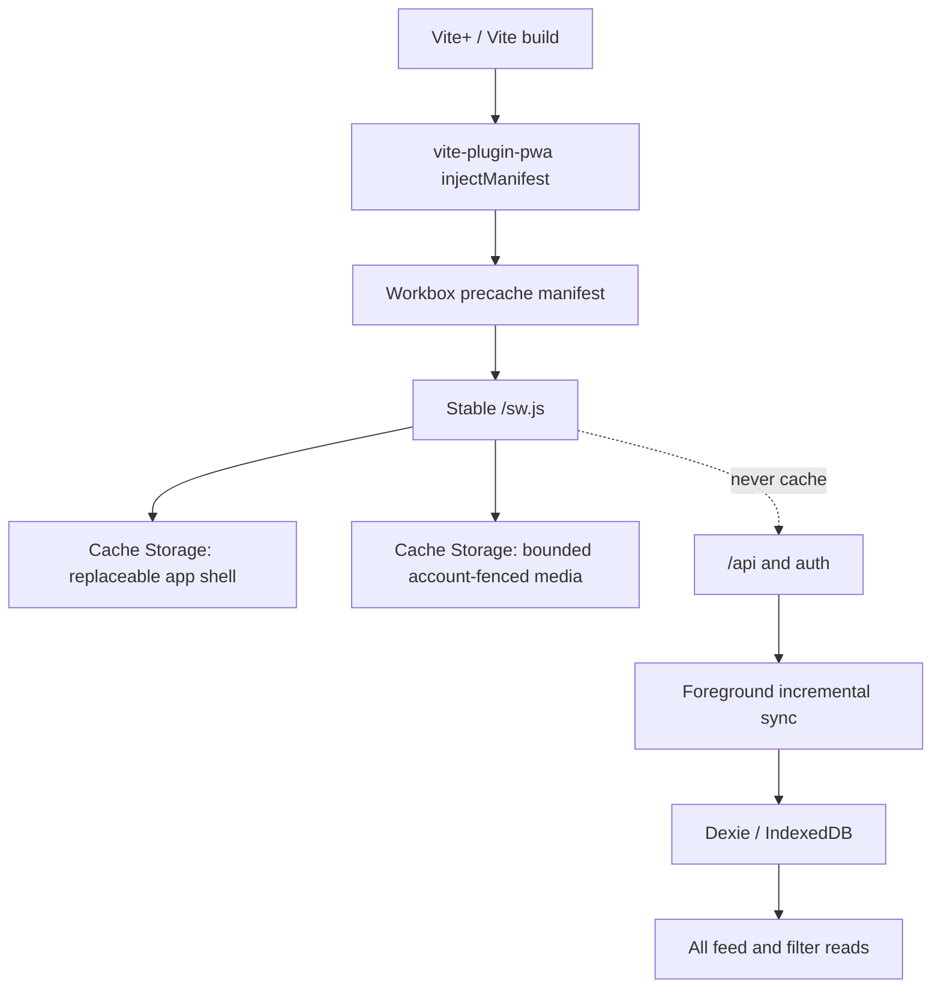

# Production PWA Architecture for Better GitHub Feed

Date: 2026-07-17

Status: Research and implementation recommendation

## Executive decision

Use **`vite-plugin-pwa` with `strategies: 'injectManifest'`**, backed by Workbox modules, rather than replacing the current worker with `generateSW` or continuing to maintain the entire build and lifecycle integration by hand.

The responsibility split should be explicit:

- **Workbox precache:** versioned application shell only: HTML, hashed JavaScript and CSS, and required local static assets.
- **Existing custom worker code:** account-fenced, bounded media caching until that subsystem can be simplified safely.
- **Dexie/IndexedDB:** the only local source of truth for Activity, Following, user filters, outbox, checkpoints, and sync state.
- **Network only:** every `/api/` and authentication request. A service-worker response cache must never become a second feed replica.
- **Foreground sync:** the reliable data-freshness mechanism remains start, focus, reconnect, and visible-session polling. Background APIs and Push are optional enhancements, not correctness dependencies.

`injectManifest` is the right fit because the project already has non-trivial custom service-worker behavior. The plugin compiles a custom worker and injects the build-time precache manifest; Workbox specifically positions `injectManifest` for advanced routing and custom caching requirements ([Vite PWA injectManifest guide](https://vite-pwa-org.netlify.app/guide/inject-manifest), [Workbox precaching comparison](https://developer.chrome.com/docs/workbox/precaching-with-workbox)).

## Current-state audit

The project already has substantial PWA foundations:

- [`apps/web/public/manifest.webmanifest`](../apps/web/public/manifest.webmanifest) declares install metadata and 192/512 icons.
- [`apps/web/src/service-worker/sw.js`](../apps/web/src/service-worker/sw.js) implements an offline shell, navigation fallback, API exclusion, and per-account cross-origin media caches.
- [`apps/web/src/lib/register-service-worker.ts`](../apps/web/src/lib/register-service-worker.ts) registers a module worker in production.
- [`apps/web/src/lib/service-worker-update.ts`](../apps/web/src/lib/service-worker-update.ts) detects installed updates.
- [`apps/web/src/local-feed/`](../apps/web/src/local-feed/) keeps structured application data in Dexie and already requests persistent storage where supported.

The weak point is not feature absence; it is the amount of lifecycle and build logic owned by the application:

1. The shell asset list is discovered by parsing runtime HTML during worker installation. Workbox precaching instead receives the actual Vite build graph, revisions un-hashed resources, incrementally installs only changed assets, and removes assets absent from the new precache during activation ([Workbox precaching](https://developer.chrome.com/docs/workbox/modules/workbox-precaching)).
2. The service worker is emitted with a content-addressed filename and its registration URL gains a shell query parameter. Workbox recommends keeping the worker URL stable and preventing its HTTP response from being held in cache, because the browser's update algorithm compares the worker at that stable registration URL ([service-worker lifecycle](https://developer.chrome.com/docs/workbox/service-worker-lifecycle)).
3. The current update path sends `SKIP_WAITING` as soon as an update finishes installing. Workbox warns that immediate activation can make an old page load subresources through a new worker and break lazy-loaded assets. The normal lifecycle intentionally keeps an update waiting until old clients are gone ([service-worker lifecycle](https://developer.chrome.com/docs/workbox/service-worker-lifecycle)).
4. The manifest currently declares the same 512 image as both `any` and `maskable`. A maskable icon is a separate full-bleed asset whose important content must fit in the central safe-zone circle with radius 40% of the image size ([Web App Manifest specification](https://www.w3.org/TR/appmanifest/#icon-masks-and-safe-zone), [MDN icon guidance](https://developer.mozilla.org/en-US/docs/Web/Progressive_web_apps/How_to/Define_app_icons)).

## Architecture



The Cache API is designed for HTTP request/response pairs, while IndexedDB is appropriate for indexed structured data. Both share the origin's storage quota, so the separation is semantic rather than a durability tier ([MDN storage quotas](https://developer.mozilla.org/en-US/docs/Web/API/Storage_API/Storage_quotas_and_eviction_criteria), [web.dev storage guidance](https://web.dev/articles/storage-for-the-web)).

### Request policy

| Request class                             | Strategy                                                    | Reason                                                                                                       |
| ----------------------------------------- | ----------------------------------------------------------- | ------------------------------------------------------------------------------------------------------------ |
| Vite hashed JS/CSS and local shell assets | Workbox precache, cache first                               | Content-addressed and tied to a single app release.                                                          |
| Navigation                                | Network first, fall back to precached app shell             | Normal web refresh can obtain current HTML; offline launch remains available.                                |
| `/api/**`, auth, sync manifests/pages     | Network only; no service-worker handler                     | IndexedDB is the sole local replica and owns freshness, transactions, account fencing, and retries.          |
| Cross-origin avatars/content images       | Retain the existing bounded, account-fenced cache initially | Media is optional and replaceable, but the current privacy/deletion semantics exceed a generic runtime rule. |
| GitHub/external destination pages         | Network only                                                | They are outside the application and should not consume local quota.                                         |

Workbox advises runtime caching rather than precaching for large, infrequently used, or device-dependent assets, and supplies bounded expiration for such caches ([runtime caching](https://developer.chrome.com/docs/workbox/caching-resources-during-runtime), [expiration](https://developer.chrome.com/docs/workbox/modules/workbox-expiration)). However, generic `StaleWhileRevalidate` plus `ExpirationPlugin` is not a drop-in replacement for this project's account generations, sign-out deletion fences, and multi-worker locking. Keep the custom media route until those guarantees have equivalent tests.

Cross-origin image responses may be opaque. Chrome DevTools documents substantial quota padding for opaque cache entries, so entry count alone is not a reliable storage budget ([Chrome PWA debugging](https://developer.chrome.com/docs/devtools/progressive-web-apps)). A later simplification should evaluate a same-origin Cloudflare image proxy, or at minimum expose `navigator.storage.estimate()` diagnostics and tune media limits from real usage.

### Offline product boundary

“Offline ready” should mean:

- the application shell opens;
- the current account's already-committed IndexedDB feed, filters, and details remain usable;
- cached images may display and uncached images may fail gracefully;
- remote synchronization clearly becomes offline/quiet without replacing local content;
- signing in, opening uncached external links, and obtaining never-synced records still require the network.

Do not precache feed JSON or cache sync responses in the service worker. Doing so creates two independently evictable replicas with different invalidation and authentication rules. IndexedDB itself does not provide server synchronization; the application must own that protocol, which the existing `LocalFeed` design already does ([MDN IndexedDB terminology](https://developer.mozilla.org/en-US/docs/Web/API/IndexedDB_API/Basic_Terminology)).

## Installation and manifest

The Web App Manifest is the platform-facing installation record. Chromium installation checks generally require a name, 192/512 icons, `start_url`, and a supported display mode, while installation UI and criteria still vary by browser ([MDN installability guide](https://developer.mozilla.org/en-US/docs/Web/Progressive_web_apps/Guides/Making_PWAs_installable), [web.dev installation](https://web.dev/learn/pwa/installation/)).

Recommended manifest baseline:

```json
{
  "id": "/",
  "name": "Better GitHub Feed",
  "short_name": "GitHub Feed",
  "description": "A local-first feed for the people you follow on GitHub.",
  "lang": "en",
  "start_url": "/",
  "scope": "/",
  "display": "standalone",
  "background_color": "#0a0a0a",
  "theme_color": "#0a0a0a"
}
```

Key details:

- Add an explicit, stable `id: "/"`. The manifest ID is the application's install identity; when absent it falls back to `start_url`. A stable ID permits future launch-URL changes without accidentally describing a second app ([Web App Manifest specification](https://www.w3.org/TR/appmanifest/#id-member), [MDN `id`](https://developer.mozilla.org/en-US/docs/Web/Progressive_web_apps/Manifest/Reference/id)).
- Keep explicit `start_url` and `scope`. Scope matching is URL-prefix based, and the specification recommends an explicit scope to avoid unexpected navigation behavior ([Web App Manifest specification](https://www.w3.org/TR/appmanifest/#scope-member)).
- Supply distinct 192 and 512 PNGs with `purpose: "any"`, plus distinct full-bleed 192 and 512 PNGs with `purpose: "maskable"`. Do not label an icon maskable until it has been visually checked under circle, squircle, and rounded-square masks ([Web App Manifest safe zone](https://www.w3.org/TR/appmanifest/#icon-masks-and-safe-zone)).
- Add a 180×180 `apple-touch-icon`. WebKit supports manifest icons but gives an HTML `apple-touch-icon` precedence, so its appearance must match the manifest identity ([WebKit Web Push for Web Apps](https://webkit.org/blog/13878/web-push-for-web-apps-on-ios-and-ipados/), [WebKit Safari 15.4](https://webkit.org/blog/12445/new-webkit-features-in-safari-15-4/)).
- Add `apple-mobile-web-app-title` only if the desired iOS label differs from the HTML title. Modern iOS recognizes `display: standalone`; the legacy `apple-mobile-web-app-capable` meta is only a compatibility fallback. Do not add `apple-mobile-web-app-status-bar-style: black-translucent` unless every screen deliberately handles safe-area insets, because it changes content placement ([Apple Safari Web Content Guide](https://developer.apple.com/library/archive/documentation/AppleApplications/Reference/SafariWebContent/ConfiguringWebApplications/ConfiguringWebApplications.html)).
- Keep scheme-specific `theme-color` meta tags in HTML. The manifest's single color remains the installed-app fallback.

### Installation UX

Installation should be discoverable but never interrupt feed use:

- On Chromium, show a small “Install app” action in the user menu only after `beforeinstallprompt` is received. It is not a cross-browser API, so installation must remain progressive enhancement ([MDN install prompt](https://developer.mozilla.org/en-US/docs/Web/Progressive_web_apps/How_to/Trigger_install_prompt)).
- On iOS/iPadOS, offer a short Share → Add to Home Screen explanation when the app is not already in standalone mode. There is no equivalent programmatic browser prompt.
- Hide installation actions in standalone mode and after `appinstalled`.
- Never show an automatic install modal or recurring banner.

## Service-worker update policy

Use the plugin's default **prompt lifecycle**, but keep its UI quiet. The plugin can report `onNeedRefresh` for diagnostics; this product should not render that state or call `updateSW()` automatically. An update discovered mid-session remains waiting until old clients close or a later sole-client startup handshake activates it. `autoUpdate` forces `skipWaiting` and `clientsClaim`, and its own documentation warns that automatic reload can discard in-progress input ([Vite PWA prompt flow](https://vite-pwa-org.netlify.app/guide/prompt-for-update), [Vite PWA automatic reload](https://vite-pwa-org.netlify.app/guide/auto-update)).

Recommended quiet lifecycle reconciles the installed app with the ordinary website:

1. **Update discovered in a running session:** keep it waiting. Do not render a prompt and do not call `skipWaiting`. The open document remains on one coherent release.
2. **Next full document load:** if a worker is already waiting, ask the worker whether this is the only controlled window. Only in that case, send `SKIP_WAITING`, wait for `controllerchange`, and reload once with a session/build-ID guard. This makes a user-initiated browser refresh or a standalone cold launch complete the update without an update banner or an unexpected mid-session reload.
3. **Other old tabs remain open:** do not force activation. Continue with the network-first document and require the page↔worker message protocol to remain backward compatible for at least one release. The waiting worker activates naturally after the last old client closes, or on a later sole-client document load.
4. **A normal refresh alone is not an activation guarantee:** the service-worker lifecycle may leave the new worker waiting again. The explicit startup handshake above is what turns a user-driven full load into a safe, observable activation attempt ([service-worker lifecycle](https://developer.chrome.com/docs/workbox/service-worker-lifecycle)).
5. **Durability gate:** local filters are already committed to IndexedDB/outbox before remote synchronization, so startup reload is generally safe. Still decline activation during an active database migration or any future non-durable editor.
6. **Long-lived SPA:** check `registration.update()` while visible, at most hourly, and on return after a long absence. This checks application code only; it is unrelated to the five-minute feed sync. Vite PWA documents an hourly guarded update pattern ([periodic service-worker updates](https://vite-pwa-org.netlify.app/guide/periodic-sw-updates)).

Deployment requirements:

- emit the registration target at stable `/sw.js`;
- serve `/sw.js` with `Cache-Control: no-cache` (or equivalent revalidation), not immutable caching;
- serve content-hashed JS/CSS with long-lived `immutable` caching;
- serve `manifest.webmanifest` with `application/manifest+json` and revalidation;
- keep the worker at the origin root so its natural scope is `/` ([service-worker scope and updates](https://developer.chrome.com/docs/workbox/service-worker-lifecycle), [manifest deployment](https://developer.mozilla.org/en-US/docs/Web/Progressive_web_apps/Manifest#deploying_a_manifest)).

## iOS and Safari constraints

- iOS/iPadOS Home Screen installation is user-driven through the Share menu. Modern WebKit uses a manifest with `display: standalone` or `fullscreen` to open a separate web-app experience ([WebKit Web Push for Web Apps](https://webkit.org/blog/13878/web-push-for-web-apps-on-ios-and-ipados/)).
- `apple-touch-icon` overrides manifest icons; test the actual Home Screen icon, launch, dark theme, status bar, safe-area layout, external links, and OAuth return on a device ([WebKit Safari 15.4](https://webkit.org/blog/12445/new-webkit-features-in-safari-15-4/)).
- Installed and browser contexts share origin quota in current Safari. Storage remains subject to quotas and user deletion, so “local-first” is not a backup guarantee ([WebKit storage policy](https://webkit.org/blog/14403/updates-to-storage-policy/)).
- iOS/iPadOS 16.4 added standards-based Push only for Home Screen web apps, and notification permission must follow direct user interaction ([WebKit Web Push for Web Apps](https://webkit.org/blog/13878/web-push-for-web-apps-on-ios-and-ipados/)).
- Use feature detection, not Safari user-agent branches. Apple also recommends standards and feature detection over browser detection ([Apple compatible web content](https://developer.apple.com/library/archive/documentation/AppleApplications/Reference/SafariWebContent/CreatingContentforSafarioniPhone/CreatingContentforSafarioniPhone.html)).

## Storage reliability

IndexedDB and Cache Storage are both best-effort by default. `navigator.storage.persist()` may promote the entire origin to persistent storage, while `navigator.storage.estimate()` provides approximate usage/quota diagnostics. Writes must handle `QuotaExceededError`; persistence cannot protect against user-initiated clearing, profile removal, or corruption ([MDN storage quotas](https://developer.mozilla.org/en-US/docs/Web/API/Storage_API/Storage_quotas_and_eviction_criteria), [MDN Storage API](https://developer.mozilla.org/en-US/docs/Web/API/Storage_API)).

The existing persistence request is directionally correct. Complete it with:

- persisted/not-persisted and approximate quota diagnostics in a developer-only panel;
- explicit handling and telemetry for IndexedDB and Cache Storage quota failures;
- shell/media cache cleanup that never deletes account databases;
- recovery UI when the app shell opens but its account database is absent or corrupt;
- product wording that says data is stored locally and can be re-synchronized, not permanently guaranteed.

## Background synchronization and Push

Do not move the primary D1→Dexie loop into Background Sync or Periodic Background Sync.

- Background Sync is limited-availability and only schedules deferred work after connectivity returns ([MDN Background Synchronization](https://developer.mozilla.org/en-US/docs/Web/API/Background_Synchronization_API)).
- Periodic Background Sync requires installation/permission where supported, and the browser—not the application—controls when it runs ([Chrome periodic background sync](https://developer.chrome.com/docs/capabilities/periodic-background-sync), [MDN offline/background operation](https://developer.mozilla.org/en-US/docs/Web/Progressive_web_apps/Guides/Offline_and_background_operation)).
- WebKit explicitly frames Web Push as notification delivery rather than permission for silent background runtime ([WebKit Meet Web Push](https://webkit.org/blog/12945/meet-web-push/), [WebKit Declarative Web Push](https://webkit.org/blog/16535/meet-declarative-web-push/)).

Therefore:

- retain Worker Cron for GitHub→D1 ingestion;
- retain foreground app start/focus/online/visible polling for D1→Dexie convergence;
- optionally use one-shot Background Sync later only to retry already-durable user-filter outbox entries;
- do not promise a periodic refresh interval when the app is closed;
- defer Push. If implemented later, send only a “remote state may have advanced” invalidation, then run the normal incremental protocol. Never put feed payloads in a push message.

Push is technically viable, including iOS Home Screen apps, but it introduces subscription rotation, endpoint cleanup, permission UX, VAPID credentials, notification deduplication, and backend fan-out. The feed is not sufficiently time-critical to justify that operational surface in the PWA baseline.

## Tooling choice

| Option                                   | Build integration  | Custom media/account logic                                              | Update UX    | Maintenance assessment                                                                                                                                                                                                      |
| ---------------------------------------- | ------------------ | ----------------------------------------------------------------------- | ------------ | --------------------------------------------------------------------------------------------------------------------------------------------------------------------------------------------------------------------------- |
| `vite-plugin-pwa` + `generateSW`         | Excellent          | Poor fit; configuration cannot naturally express current account fences | Built in     | Best for a simple shell, but replacing the current worker would regress required behavior.                                                                                                                                  |
| **`vite-plugin-pwa` + `injectManifest`** | **Excellent**      | **Retains current code and allows Workbox routes/modules**              | **Built in** | **Recommended. Mature build/lifecycle ownership with bounded project-specific code.**                                                                                                                                       |
| Direct `workbox-build`                   | Manual Vite wiring | Full control                                                            | Manual       | Same underlying capability with more integration code and no present benefit.                                                                                                                                               |
| Fully native/manual worker               | Fully manual       | Full control                                                            | Manual       | Highest lifecycle, cache-version, and multi-tab risk. Workbox explicitly notes that manual cache maintenance is difficult ([service-worker lifecycle](https://developer.chrome.com/docs/workbox/service-worker-lifecycle)). |

`generateSW` may become appropriate only after media is moved out of the worker or its account lifecycle is intentionally discarded. Today, `injectManifest` is the maintainable middle path.

## Testing and observability

### Automated release tests

Run service-worker tests against a production build served by `vp preview` or an equivalent local production server. Development SW support is useful for iteration but differs from the emitted production worker; Vite PWA recommends build tests plus in-browser tests and uses Chromium browser tests for its own examples ([Vite PWA testing](https://vite-pwa-org.netlify.app/guide/testing-service-worker), [Vite PWA development behavior](https://vite-pwa-org.netlify.app/guide/development)).

Minimum test matrix:

1. First online visit installs the worker; second launch works fully offline.
2. A deep-link navigation falls back to the app shell offline.
3. Offline with populated IndexedDB renders local feed immediately; offline with empty IndexedDB renders an honest empty/unavailable state.
4. `/api/` responses never appear in Cache Storage.
5. Cross-origin cached media cannot cross account generations and is deleted on fenced sign-out.
6. A v1 tab remains usable while v2 waits and serves no mixed-version lazy chunk.
7. Two tabs can close in either order; v2 activates only after the last v1 client closes.
8. Storage quota failure does not corrupt IndexedDB checkpoints or make online images fail.
9. Clearing Cache Storage preserves IndexedDB; clearing site data triggers clean bootstrap.
10. Manifest, normal icons, maskable icons, install, offline launch, OAuth return, and safe areas are tested on Chrome Android and a real iPhone/iPad Home Screen installation.

Chrome's Application panel inspects manifest warnings, worker lifecycle, Cache Storage, IndexedDB, and quota distribution; it can also force update/offline states and record background-service activity ([Application panel](https://developer.chrome.com/docs/devtools/application), [PWA debugging](https://developer.chrome.com/docs/devtools/progressive-web-apps)).

### Production signals

Record small, privacy-safe lifecycle events locally and submit sampled summaries on a later successful online session:

- worker registration success/failure;
- update found, installed/waiting, activated, and `controllerchange`;
- update discovered/waiting, startup activation requested/declined/succeeded, and activation latency;
- offline shell launch success/failure;
- storage persistence result and coarse quota utilization bucket;
- `QuotaExceededError`, shell fallback failure, and media cache failure;
- current app build ID and worker build ID when a mismatch is detected.

Do not include GitHub IDs, feed URLs, image URLs, OAuth state, or cached content. Console diagnostics should be enabled in development; production reporting should be sampled and non-blocking.

## Phased implementation

### Phase 0 — characterization tests

- Add production-build browser tests for the current offline shell, account media fencing, API exclusion, and update lifecycle.
- Add a build assertion for stable worker URL, required precache entries, manifest MIME/fields, and deployment cache headers.
- Capture current Cache Storage behavior so the migration cannot silently weaken sign-out privacy.

### Phase 1 — manifest and install completeness

- Add stable manifest `id`, `lang`, separate normal/maskable 192/512 assets, and a 180 Apple touch icon.
- Validate every maskable shape against the specification safe zone.
- Add unobtrusive install actions: Chromium event-driven action and iOS instructions; no automatic banner.
- Verify standalone detection with `matchMedia('(display-mode: standalone)')` and `navigator.standalone` only as the iOS compatibility fallback.

### Phase 2 — migrate build and shell lifecycle

- Add `vite-plugin-pwa` and Workbox modules.
- Configure `strategies: 'injectManifest'`, `srcDir: 'src/service-worker'`, and `filename: 'sw.ts'`. The plugin resolves that source as `src/service-worker/sw.ts`, changes the TypeScript destination and registration filename to `sw.js`, and writes it into Vite's build output; with root scope/base it is served and registered as stable `/sw.js` ([vite-plugin-pwa option resolution source](https://github.com/vite-pwa/vite-plugin-pwa/blob/main/src/options.ts)).
- Convert the worker to TypeScript and replace HTML-regex shell discovery/cache versioning with `precacheAndRoute(self.__WB_MANIFEST)` and Workbox cleanup.
- Keep `/api/` and auth network-only. Add a network-first navigation route with a precached shell fallback.
- Preserve the existing media account registry, write queue, generation fence, bounded pruning, and tests.
- Configure deployment caching: revalidate `sw.js`/manifest, immutable hashed assets.

### Phase 3 — safe update UX

- Replace unconditional update-time `SKIP_WAITING` with the normal waiting lifecycle; use `onNeedRefresh` only for diagnostics.
- Keep both standalone and normal browser UI free of reload/update prompts.
- Add the sole-client startup activation handshake, guarded `controllerchange` reload-once behavior, visible-session update checks, backward-compatible worker messages, multi-tab waiting behavior, and instrumentation.
- Test quiet activation across two deployed builds, including lazy-loaded detail code and the case where another old tab prevents activation.

### Phase 4 — storage and resilience

- Add coarse `estimate()`/`persisted()` diagnostics and quota-error paths.
- Audit the effective size of opaque media responses; lower limits if necessary.
- Evaluate a same-origin Cloudflare media proxy as a separate design, including security, cost, cache key, and abuse controls. Only then consider replacing the custom media subsystem with ordinary Workbox runtime caching.
- Document recovery behavior for evicted/corrupt IndexedDB and cleared site data.

### Deferred

- One-shot Background Sync for durable outbox retries: only after cross-browser fallback tests.
- Periodic Background Sync: no product dependency or freshness promise.
- Push/notifications/badging: only after a separate product and operations decision.
- App-store packaging, shortcuts, share targets, and file handlers: no current feed requirement.

## Acceptance criteria

The PWA work is complete when:

- install identity and icons are correct on Chromium and iOS;
- the shell opens offline without network or API cache duplication;
- existing IndexedDB local-first behavior is unchanged;
- account-scoped media privacy tests still pass;
- a service-worker update never activates unexpectedly over an old open client;
- installed and ordinary web users do not regain reload/update prompts;
- a waiting update activates after the last old client closes or a sole-client startup handshake, then controls the guarded reload/next launch;
- stable worker URL and cache headers make update checks reliable;
- quota, offline-launch, and lifecycle failures are diagnosable;
- the production build passes the two-release, two-tab, offline, and real-device matrix.
